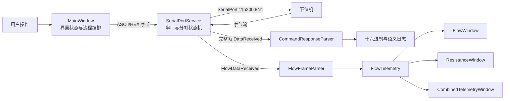

# SelfCheckTool 项目理解

> [!summary] 一句话定位
> SelfCheckTool 是一个面向 Windows 的串口调试/设备自检桌面工具：它连接下位机，发送预置或手工命令，解析二进制回复，并在振荡测定期间实时展示流速、阻力等遥测曲线。

## 1. 当前结论

- 项目是单程序集 WPF 应用，技术栈为 C#、.NET 6 Windows、LiveChartsCore/SkiaSharp、`System.IO.Ports` 和 WMI。
- 代码规模较小，共 18 个手写 `.cs`/`.xaml` 文件，主要逻辑集中在 `MainWindow.xaml.cs`（690 行）和 `SerialPortService.cs`（313 行）。
- 当前采用“XAML + code-behind + 少量模型/服务”的轻量结构，没有完整 MVVM、依赖注入或持久化层。
- 发送侧支持 ASCII/HEX 两种模式；默认是 ASCII、无换行。串口参数固定为 `115200 / 8N1`。
- 接收侧按帧头 `5A A5` 和帧尾 `A5 5A` 分帧，普通回复交给 `CommandResponseParser`，遥测数据交给 `FlowFrameParser`。
- 项目在 2026-08-27 已实际执行 `dotnet build SelfCheckTool.csproj --no-restore`，结果为 **0 错误、4 警告**。
- 当前源码目录未检测到可用的 Git 仓库元数据；也没有 README、自动化测试项目或项目级 `AGENTS.md`。

> [!note] 业务边界说明
> 从“雾化压力、激发剂、舒张剂、口罩压力、振荡频率、流速、阻力、SpO2、HR”等命名判断，该工具服务于呼吸检测/治疗类设备的下位机联调或产测自检。这是基于源码命名的推断，具体设备型号、临床用途和协议权威定义仍需产品或协议文档确认。

## 2. 用户能完成什么

主窗口标题为“串口检测工具”，当前用户流程是：

1. 启动应用，自动扫描本机 COM 口，并通过 WMI 补充设备友好名称。
2. 选择串口并打开连接。
3. 从命令菜单、命令面板、快捷按钮或输入框选择/输入命令。
4. 以 ASCII 或 HEX 模式发送数据；HEX 模式可以附加 CR、LF 或 CRLF。
5. 查看接收帧的十六进制日志和部分命令的语义化解析结果。
6. 导出当前接收日志为 UTF-8 文本文件。
7. 发送振荡测定开始命令后，打开流速、阻力或双曲线实时窗口。

界面由五个窗口组成：

| 窗口 | 职责 |
| --- | --- |
| `MainWindow` | 串口连接、命令选择与发送、接收日志、测定窗口入口 |
| `CommandPanelWindow` | 按分类浏览和搜索命令，选择后填入主窗口 |
| `FlowWindow` | 实时显示流速曲线，最多保留 300 点 |
| `ResistanceWindow` | 实时显示阻力曲线，最多保留 300 点 |
| `CombinedTelemetryWindow` | 双 Y 轴同时显示流速和阻力，最多各保留 300 点 |

## 3. 技术架构



### 3.1 分层职责

| 层次 | 文件 | 当前职责 |
| --- | --- | --- |
| 应用入口 | `App.xaml`, `App.xaml.cs` | 启动 `MainWindow`，没有全局资源或启动服务 |
| 主界面 | `MainWindow.xaml(.cs)` | 几乎所有业务状态、命令定义、发送、日志和窗口生命周期 |
| 辅助界面 | `CommandPanelWindow.xaml(.cs)` | 命令搜索、分组和选择 |
| 图表界面 | `FlowWindow`、`ResistanceWindow`、`CombinedTelemetryWindow` | 遥测点集合、当前值、LiveCharts 配置 |
| 串口服务 | `Services/SerialPortService.cs` | 枚举/打开/关闭/写串口，后台消费接收队列并按头尾分帧 |
| 协议解析 | `Services/CommandResponseParser.cs` | 解析普通命令回复并格式化日志 |
| 遥测解析 | `Services/FlowFrameParser.cs` | 把二进制帧解析为 `FlowTelemetry` |
| 数据模型 | `Models/*` | 命令项、串口项、普通回复、遥测值 |

### 3.2 状态与线程模型

- `SerialPort.DataReceived` 回调只读取当前可用字节，并逐字节写入 `ConcurrentQueue<byte>`。
- 后台 `Task` 每 20 ms 排空队列，通过三态状态机寻找完整帧。
- 普通帧事件和遥测事件都从后台线程触发。
- 主窗口日志通过 `Dispatcher.Invoke` 切回 UI 线程。
- 三个图表窗口的 `AddSample` 也各自通过 `Dispatcher.Invoke` 更新 `ObservableCollection`。
- 关闭主窗口时会退订事件、停止后台循环、释放串口，并关闭所有图表窗口。

## 4. 串口协议理解

### 4.1 接收帧边界

当前分帧规则：

```text
5A A5  [payload，长度不固定]  A5 5A
```

状态机包含：

1. `SearchHeader`：等待 `0x5A`。
2. `HeaderPartial`：等待紧随其后的 `0xA5`。
3. `ReadingPayload`：持续收集，遇到 `0xA5 0x5A` 即提交完整帧。

当前没有使用长度字段、校验和/CRC、转义机制或最大帧长。

### 4.2 普通回复

`CommandResponseParser` 读取帧第 2、3 字节作为大端命令码：

| 命令 | 已实现的语义解析 |
| --- | --- |
| `0001` | 下位机状态；读取错误码、子错误码和三个 16 位值 |
| `0002` | 温度、湿度、大气压、雾化压力；分别按 `/1000`、`/1000`、`/10`、原值缩放 |
| `0005` | 读取 8 字节 ASCII 软件版本 |
| 其他 | 通用读取错误码、子错误码和三个 16 位值 |

代码中维护了 19 个硬件错误码，包括供电、温湿度、压力、MCU 通讯、ADS1220、偏流、流量/口压传感器、喇叭和控制命令异常等。

### 4.3 遥测帧

`FlowFrameParser` 要求至少 20 字节，并按大端序解析：

| 字节偏移 | 长度 | 字段 | 缩放/说明 |
| ---: | ---: | --- | --- |
| 2 | 2 | `Instruct` | 16 位命令码 |
| 4 | 1 | `Feature` | 特征/错误字段 |
| 5 | 4 | `AcquisitionTime` | 32 位值 `/1000`，界面按秒展示 |
| 9 | 1 | `Sign1` | 符号/标志字段，当前仅转字符串 |
| 10 | 2 | `Flow` | 16 位值 `/1000` |
| 12 | 1 | `MeasuringCondition` | 测量状态 |
| 13 | 1 | `Turning` | 转向/阶段字段 |
| 14 | 2 | `Resistance` | 16 位值 `/10` |
| 16 | 1 | `SpO2` | 血氧值，当前未显示 |
| 17 | 1 | `HR` | 心率值，当前未显示 |
| 18 | 2 | `MeanVelocity` | 16 位值 `/1000`，当前未显示 |

`RawFrame` 会保留完整原始帧。`SpO2`、`HR`、`MeanVelocity`、`MeasuringCondition`、`Turning` 等数据已进入模型，但现有 UI 只消费采集时间、流速和阻力。

## 5. 命令体系

命令定义目前硬编码在 `MainWindow.xaml.cs`，共 35 条，按以下类别组织：

| 类别 | 代表命令 | 用途 |
| --- | --- | --- |
| 基础读取 | `0001`～`0005` | 状态、温湿度、压力、版本 |
| 设备维护 | `0008` | 软件复位 |
| 电磁阀检测 | `1001`～`1012`, `1100`, `1110` | 各试剂/舒张剂阀检测和停止 |
| 测定控制 | `2000`, `2100` | 开始/结束测定 |
| 设备控制 | `2001`, `2101` | 泵开/关 |
| 校准 | `3000`, `3001`, `3002021`, `3003105`, `3101`, `3102` | 校准、阻力管标签值和中止 |
| 振荡测定 | `400003`, `400007`, `4100`, `4006`, `4008` | 3Hz/7Hz 测定、停止、阀控制 |

命令既出现在主窗口动态菜单和搜索下拉框，也有 3Hz、7Hz、停止三个快捷按钮。命令数据没有独立配置文件，因此新增/修改命令目前需要重新编译。

## 6. 构建与依赖现状

### 已验证

```text
命令：dotnet build SelfCheckTool.csproj --no-restore
结果：成功
错误：0
警告：4
产物：bin/Debug/net6.0-windows/SelfCheckTool.dll
```

### 直接依赖

| 包 | 版本 | 用途 |
| --- | --- | --- |
| `LiveChartsCore` | `2.0.0-rc4.5` | 图表抽象 |
| `LiveChartsCore.SkiaSharpView.WPF` | `2.0.0-rc4.5` | WPF 图表实现 |
| `System.IO.Ports` | `6.0.0` | 串口通讯 |
| `System.Management` | `6.0.0` | WMI 查询 COM 口友好名称 |

### 构建警告

- `net6.0-windows` 已结束支持，不再接收安全更新（`NETSDK1138`）。
- 传递依赖 `OpenTK 3.3.1`、`OpenTK.GLWpfControl 3.3.0`、`SkiaSharp.Views.WPF 3.0.0-preview.4.1` 是按 .NET Framework 资产恢复的，NuGet 提示与当前目标框架可能不完全兼容（`NU1701`）。

## 7. 新需求前最值得注意的现状

### 高优先级：协议与运行稳定性

1. **分帧缺少保护。** 没有长度、CRC、转义和最大帧长；载荷中自然出现 `A5 5A` 会提前截帧，持续收不到帧尾时 `_frameBuffer` 会无限增长。
2. **遥测识别条件过宽。** 每个完整帧都会尝试按遥测格式解析，只检查 `Length >= 20`，没有校验帧头、帧尾、命令码或精确长度；较长的普通回复可能被误报为遥测。
3. **底层异常被吞掉。** 串口读取、后台任务停止、遥测解析中的异常多处空 `catch`，现场故障难定位。
4. **协议字段可能有符号问题。** `Sign1` 已解析但没有用于 `Flow` 等数值，若协议用它表达正负方向，当前曲线会丢失符号语义。

### 高优先级：可见的功能不一致

1. **7Hz 测定不会解锁曲线窗口。** `CanOpenMeasurementWindows` 只在发送 `400003` 后设为 `true`；快捷命令 `400007` 不会触发同样行为。
2. **测定状态以“已发送”为准，不以设备确认或遥测到达为准。** 即使命令发送后设备拒绝/失败，曲线入口仍可能开启。
3. **命令面板存在不可达逻辑。** `CommandPanelWindow` 实现了“立即发送 + 危险命令确认”，但 XAML 没有绑定 `SendButton_Click` 的按钮；当前只能“填入发送框”。
4. **详细错误没有显示。** `ErrorMessage` 保存异常文本并驱动警告配色，但主窗口状态栏只绑定 `StatusMessage`，用户看不到真正的异常原因。

### 中优先级：性能与可维护性

1. `ReceivedHexMessage += ...` 会不断复制整个字符串；非测量模式下长时间收包可能导致内存和 UI 性能下降。
2. 测量模式虽然不写日志，但每帧仍同步调度一次 UI 线程后再返回；若三个图表同时打开，每个样本还会发生三次同步 UI 调度。
3. 三种曲线窗口有大量重复代码，新增暂停、缩放、导出、清空或更多指标时容易产生三套实现。
4. 主窗口同时承担视图状态、业务编排、协议发送和日志格式化，继续叠加需求会快速变重。
5. 串口参数固定，不能在 UI 中选择波特率、校验位、数据位、停止位或读写超时。
6. 图表只保留窗口打开后的最近 300 点，没有共享缓存、测量会话、暂停/清空、数据导出或落盘。
7. 命令定义和危险级别分散在代码中；部分描述不完整或重复，例如 `3000`/`3001` 都叫“校准”，`400007` 的描述仍是命令码本身。
8. 没有自动化测试。解析器和分帧状态机是最适合先补单元测试的区域。

## 8. 下一步需求的建议落点

| 新需求类型 | 推荐首先改动的位置 | 建议 |
| --- | --- | --- |
| 新增/修改设备命令 | `CommandOption` 与命令目录 | 把硬编码列表抽成独立 `CommandCatalog`；如需运营配置，再考虑 JSON |
| 新协议字段或新回复 | `Services/*Parser` + `Models/*` | 保持解析与 UI 分离，并为真实帧样本补测试 |
| 新实时指标/图表 | `FlowTelemetry` + 遥测展示层 | 先抽共享的测量会话/缓冲区，避免继续复制窗口逻辑 |
| 自动自检流程 | 新建工作流/状态机服务 | 不建议把步骤、超时、重试继续堆进 `MainWindow` |
| 日志/数据导出 | 新建会话记录服务 | 区分原始帧、结构化遥测、用户操作与错误日志 |
| 串口可配置 | `SerialPortService.Open` 的配置模型 + UI | 用配置对象表达参数，并持久化最近选择 |
| 可靠性改造 | `SerialPortService` | 按正式协议加入长度/校验/上限/错误事件和可观测诊断 |
| UI 大幅扩展 | ViewModel/服务拆分 | 无需一次性重写，但新功能应从 code-behind 中逐步外移 |

## 9. 建议的新需求实施基线

在明确下一项需求后，建议按以下顺序开展：

1. 先取得协议说明或至少一组真实的发送/接收 HEX 样本，确认帧长度、校验、符号位和命令应答关系。
2. 明确需求属于“调试工具能力”还是“正式产测/临床工作流”；两者对错误恢复、追溯和数据保存的要求差异很大。
3. 为会被改动的解析器或状态机补最小测试，再实现功能，避免只能依赖实机回归。
4. 若新需求涉及持续测量，优先引入独立的测量会话状态，不再只用 `CanOpenMeasurementWindows` 一个布尔值表达设备状态。
5. 保留 ASCII/HEX 手工调试入口，但把正式业务命令封装成明确方法/对象，减少字符串命令在 UI 内传播。

## 10. 下一项需求最好一并提供的信息

- 需求目标和验收标准。
- 对应的设备协议版本、示例帧或串口抓包。
- 哪些命令是危险操作，是否必须二次确认。
- 是否需要兼容现有 .NET 6 部署环境，还是允许升级运行时和图表依赖。
- 是否需要记录测量会话、导出 CSV/Excel、生成报告或支持历史回放。
- 是否能连接实机验证；如果不能，是否需要先实现串口模拟器/回放器。

## 11. 关键源码索引

```text
SelfCheckTool/
├─ App.xaml(.cs)                         # WPF 启动入口
├─ MainWindow.xaml(.cs)                  # 主界面与主要业务编排
├─ CommandPanelWindow.xaml(.cs)          # 命令浏览/搜索
├─ FlowWindow.xaml(.cs)                  # 流速曲线
├─ ResistanceWindow.xaml(.cs)            # 阻力曲线
├─ CombinedTelemetryWindow.xaml(.cs)     # 双曲线
├─ Models/
│  ├─ CommandFormat.cs                   # 普通命令解析结果
│  ├─ CommandOption.cs                   # 命令目录项
│  ├─ FlowTelemetry.cs                   # 遥测模型
│  └─ SerialPortItem.cs                  # 串口展示模型
├─ Services/
│  ├─ SerialPortService.cs               # 串口、队列、分帧状态机
│  ├─ CommandResponseParser.cs           # 普通回复解析/日志格式化
│  └─ FlowFrameParser.cs                 # 遥测帧解析
└─ SelfCheckTool.csproj                  # .NET 6 WPF 与 NuGet 依赖
```

---

> [!info] 文档范围
> 本文基于 2026-08-27 工作区源码静态阅读和一次成功构建。未连接真实硬件、未执行端到端串口测试，也没有协议原文可供交叉验证；涉及设备业务含义的内容应以正式协议为准。
