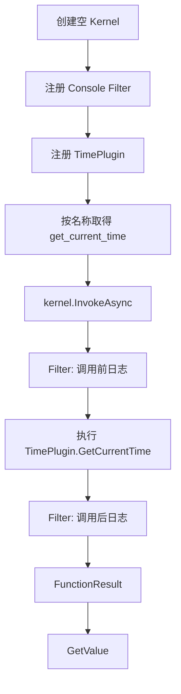
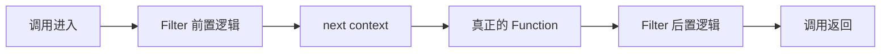
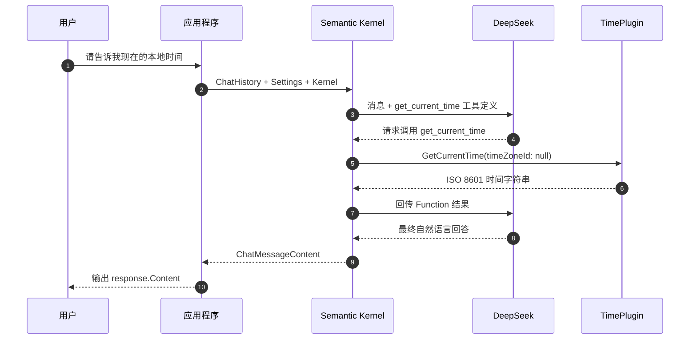
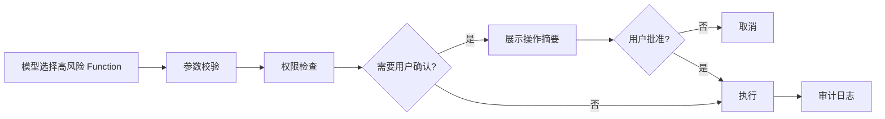
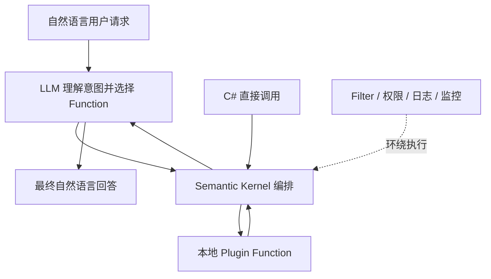

# Semantic Kernel 学习指南——基于 SemanticKernelDemo

> [!abstract] 这份资料讲什么
> 本文以当前 `SemanticKernelDemo` 控制台项目为唯一主线，从零解释 **Kernel、Plugin、Function、Chat Completion、Function Calling 和 Filter**。读完后，你应该能看懂项目的完整调用链，知道 Semantic Kernel（下文简称 SK）替你做了什么，并能独立增加一个新的本地工具。

## 导航

- 基础心智模型：[[#1. 先建立正确的整体认识]]
- 项目依赖与配置：[[#3. 项目的构建基础]]
- 三个核心对象：[[#4. 三个最核心的对象：Kernel、Plugin、Function]]
- 离线直接调用：[[#5. 第一条调用链：离线直接调用]]
- 自动 Function Calling：[[#8. 第二条调用链：DeepSeek 自动 Function Calling]]
- 运行与调试：[[#10. 如何运行项目]]、[[#12. 调试清单]]
- 动手练习：[[#13. 从这个项目继续练习]]
- 生产化注意事项：[[#14. 走向真实项目时需要补齐什么]]
- 概念复习：[[#16. 概念速查表]]、[[#17. 自测题]]

## 1. 先建立正确的整体认识

### 1.1 一句话理解 Semantic Kernel

Semantic Kernel 是一个把以下三类东西组织在一起的 .NET SDK：

1. **大模型服务**：例如 OpenAI、Azure OpenAI，以及本项目使用的 OpenAI-compatible DeepSeek 接口；
2. **本地业务能力**：普通 C# 方法、数据库查询、HTTP API、文件操作等；
3. **编排过程**：把提示词发给模型、向模型描述可用工具、执行模型选择的工具、再把工具结果交还模型。

它不是大模型本身，也不是只能用于聊天的 UI 框架。更准确的心智模型是：

> **SK 是应用代码与 AI 模型之间的编排层。**

### 1.2 本项目展示的两层能力

本项目故意把学习过程拆成两层：

| 层次 | 入口 | 是否需要 LLM | 谁选择函数 | 核心 API |
|---|---|---:|---|---|
| 第一层：直接调用 | `RunDirectInvocationAsync` | 否 | C# 代码 | `kernel.InvokeAsync(...)` |
| 第二层：自动 Function Calling | `RunDeepSeekFunctionCallingAsync` | 是 | 大模型 | `GetChatMessageContentAsync(...)` + `FunctionChoiceBehavior.Auto()` |

这个设计非常适合初学者。它证明了两个重要事实：

- Plugin 和 Function 并不依赖大模型；没有配置任何 AI 服务，Kernel 仍能调用本地函数。
- LLM 接入后，本地函数本身没有改变；变化的是“由谁决定何时调用它”。

### 1.3 项目总体结构

```text
SemanticKernelDemo/
├── SemanticKernelDemo.csproj       # 目标框架、NuGet 依赖、配置文件复制规则
├── Program.cs                       # 两条演示链路和 DeepSeek 配置
├── Plugins/
│   └── TimePlugin.cs                # 提供当前时间的本地能力
├── Filters/
│   └── ConsoleFunctionInvocationFilter.cs
│                                    # 观察 Function 调用前后的过滤器
├── appsettings.json                 # Endpoint、ModelId 和空的 ApiKey
├── appsettings.Local.json           # 本地密钥文件，不应提交
└── README.md                        # 项目最简运行说明
```

> [!info] 源码导航
> - [Program.cs](./Program.cs)
> - [TimePlugin.cs](./Plugins/TimePlugin.cs)
> - [ConsoleFunctionInvocationFilter.cs](./Filters/ConsoleFunctionInvocationFilter.cs)
> - [SemanticKernelDemo.csproj](./SemanticKernelDemo.csproj)
> - [appsettings.json](./appsettings.json)
> - [README.md](./README.md)

## 2. 推荐学习路线

不要一开始就把所有注意力放在提示词或 Agent 上。按下面顺序学习更容易形成稳定的知识结构：

- [ ] 运行默认的离线示例，观察直接调用；
- [ ] 理解 `Kernel → Plugin → Function` 三层关系；
- [ ] 阅读 `TimePlugin` 的特性和参数描述；
- [ ] 阅读 Filter，理解函数调用管线；
- [ ] 理解 `IChatCompletionService` 与 `ChatHistory`；
- [ ] 画出自动 Function Calling 的多轮请求过程；
- [ ] 配置 API Key 后，再运行联网示例；
- [ ] 自己增加一个 Function；
- [ ] 最后再扩展多轮对话、流式输出、依赖注入和错误处理。

可以把本文当成一篇 Obsidian 主笔记，后续把自己的实验笔记链接到这里：

```markdown
## 我的实验

- [[实验-增加日期格式化函数]]
- [[实验-为Plugin注入服务]]
- [[实验-实现多轮聊天]]
```

## 3. 项目的构建基础

### 3.1 项目类型与版本

`SemanticKernelDemo.csproj` 中最关键的配置是：

```xml
<OutputType>Exe</OutputType>
<TargetFramework>net8.0</TargetFramework>
<ImplicitUsings>enable</ImplicitUsings>
<Nullable>enable</Nullable>
```

- `Exe`：这是控制台程序，入口使用 C# 顶级语句写在 `Program.cs` 中。
- `net8.0`：目标运行时是 .NET 8。
- `ImplicitUsings`：项目会自动导入一批常用命名空间。
- `Nullable`：启用可空引用类型检查，所以 `string?` 与 `string` 的含义不同。

### 3.2 NuGet 依赖

```xml
<PackageReference Include="Microsoft.Extensions.Configuration.Json" Version="10.0.9" />
<PackageReference Include="Microsoft.SemanticKernel" Version="1.80.0" />
```

| 包 | 在本项目中的用途 |
|---|---|
| `Microsoft.SemanticKernel` | Kernel、Plugin、Function、Chat Completion、OpenAI Connector、Filter 等核心功能 |
| `Microsoft.Extensions.Configuration.Json` | 从 `appsettings.json` 与 `appsettings.Local.json` 读取配置 |

> [!warning] 版本意识
> 本文解释的是项目锁定的 `Microsoft.SemanticKernel 1.80.0`。SK 仍在持续演进，网上较旧教程中的类型名、命名空间、Planner API 或工具调用配置可能与本项目不同。学习时优先以当前项目能编译的 API 为准。

### 3.3 配置文件为何能在输出目录被找到

项目文件还有这一段：

```xml
<None Update="appsettings*.json">
  <CopyToOutputDirectory>PreserveNewest</CopyToOutputDirectory>
</None>
```

它会把匹配 `appsettings*.json` 的文件复制到构建输出目录。代码随后使用：

```csharp
.SetBasePath(AppContext.BaseDirectory)
```

因此程序读取的是**程序输出目录**中的配置，而不是依赖当前终端所在目录。这样从 IDE、命令行或其他目录启动时，配置路径更稳定。

## 4. 三个最核心的对象：Kernel、Plugin、Function

### 4.1 Kernel：运行时容器与编排中心

本项目用下面的方式创建最小 Kernel：

```csharp
var kernel = Kernel.CreateBuilder().Build();
```

可以把 Kernel 理解成一个同时保存以下内容的运行时容器：

- 已注册的 AI 服务；
- 已注册的 Plugin 和 Function；
- 函数调用过滤器；
- 依赖注入服务；
- 执行 Function 时需要的上下文。

`Kernel.CreateBuilder()` 对应“配置阶段”，`Build()` 对应“构建可用实例”。这与 ASP.NET Core 中的 builder 模式很相似。

> [!tip] 初学者心智模型
> Kernel 不是“AI 大脑”。模型负责理解语言和做选择，Kernel 负责持有服务、暴露工具并执行编排。

### 4.2 Plugin：一组相关能力

`TimePlugin` 首先只是一个普通 C# 类：

```csharp
public sealed class TimePlugin
{
    // ...
}
```

下面这行代码扫描该类型，把带 `[KernelFunction]` 的方法注册到 Kernel：

```csharp
var timePlugin = kernel.Plugins.AddFromType<TimePlugin>("Time");
```

此时：

- C# 类型名是 `TimePlugin`；
- 注册到 Kernel 中的 Plugin 名是 `Time`；
- Plugin 是对一组相关 Function 的逻辑归类。

在真实项目里，可以按业务边界拆分 Plugin，例如：

```text
OrderPlugin
├── get_order
├── cancel_order
└── list_recent_orders

WeatherPlugin
├── get_current_weather
└── get_forecast
```

一个好 Plugin 应该职责清晰，而不是把所有业务方法都塞进一个巨型类。

### 4.3 Function：模型或代码能执行的具体能力

项目中的 Function 来自这个方法：

```csharp
[KernelFunction("get_current_time")]
[Description("获取当前时间。未指定时区时，返回运行此程序的电脑的本地时间。结果为包含 UTC 偏移量的 ISO 8601 格式。")]
public string GetCurrentTime(
    [Description("可选的 Windows 时区 ID。为空时使用本机本地时区，例如 China Standard Time。")] string? timeZoneId = null)
```

这里有三套名字，必须区分：

| 层次 | 名字 | 用途 |
|---|---|---|
| C# 方法名 | `GetCurrentTime` | C# 源码中使用 |
| Function 名 | `get_current_time` | Kernel 与模型看到的工具名 |
| 完整逻辑名 | `Time.get_current_time` | Plugin 名 + Function 名，日志中使用 |

代码可以通过 Function 名取到它：

```csharp
var getCurrentTime = timePlugin["get_current_time"];
```

然后直接执行：

```csharp
var result = await kernel.InvokeAsync(getCurrentTime);
```

### 4.4 `[Description]` 不是普通注释

对 Function Calling 来说，模型通常看不到你的 C# 方法体。模型主要根据以下元数据决定是否调用、如何填写参数：

- Function 名；
- Function 描述；
- 参数名；
- 参数类型；
- 参数描述；
- 参数是否必填。

所以 `[Description]` 实际上是工具接口设计的一部分。描述模糊时，模型更容易选错工具或生成错误参数。

一个好的描述应说明：

1. 函数做什么；
2. 什么时候应该使用；
3. 参数接受什么格式；
4. 返回值是什么格式；
5. 有哪些关键限制。

本项目已经说明 `timeZoneId` 应是 Windows 时区 ID，并举出了 `China Standard Time`。这比只写“时区”更容易让模型正确调用。

## 5. 第一条调用链：离线直接调用

### 5.1 入口选择

程序首先检查命令行参数：

```csharp
var runDeepSeekDemo = args.Contains("--deepseek", StringComparer.OrdinalIgnoreCase);
```

随后无条件运行离线示例：

```csharp
await RunDirectInvocationAsync();
```

只有显式传入 `--deepseek` 时才执行联网示例。这是一个很好的默认安全策略：普通运行不会意外消耗模型额度，也不会发出网络请求。

### 5.2 完整执行流程



对应的核心代码只有几行：

```csharp
var kernel = Kernel.CreateBuilder().Build();
kernel.FunctionInvocationFilters.Add(new ConsoleFunctionInvocationFilter());
var timePlugin = kernel.Plugins.AddFromType<TimePlugin>("Time");
var getCurrentTime = timePlugin["get_current_time"];
var result = await kernel.InvokeAsync(getCurrentTime);
```

### 5.3 为什么没有 AI 服务也能运行

`kernel.InvokeAsync(function)` 的含义是：“请 Kernel 执行我明确指定的这个 Function”。这里不需要理解自然语言，也不需要选择工具，因此没有 LLM 参与。

这说明 Plugin 可以同时用于：

- 普通程序内部的统一函数调用；
- 测试 Function 是否能正确运行；
- 让 LLM 自动选择调用；
- 后续更复杂的工作流或 Agent 编排。

### 5.4 `FunctionResult` 与结果取值

`InvokeAsync` 返回的不是裸 `string`，而是 SK 的 Function 结果对象。项目使用：

```csharp
result.GetValue<string>()
```

将内部结果按预期类型取出。这样 SK 可以在统一结果对象中携带值和其他执行信息。

如果泛型类型和函数实际返回值不匹配，取值可能失败。真实项目应明确函数返回类型，并在边界处做好错误处理。

### 5.5 已验证的离线输出

本项目的默认模式已实际运行通过，输出结构如下；具体时间每次都会变化：

```text
Kernel 已注册 Plugin：Time
Function：get_current_time
说明：获取当前时间……

[SK] 即将调用：Time.get_current_time
[SK] 参数：（无参数）
[SK] 返回值：2026-08-26T15:57:01.0195091+08:00
直接调用结果：2026-08-26T15:57:01.0195091+08:00
```

看到 `[SK]` 三行日志，就证明调用经过了 Filter。

## 6. TimePlugin 逐段理解

### 6.1 无参数时：本机本地时间

```csharp
var now = string.IsNullOrWhiteSpace(timeZoneId)
    ? DateTimeOffset.Now
    : /* 指定时区的分支 */;
```

当没有传 `timeZoneId` 时，使用 `DateTimeOffset.Now`。与 `DateTime.Now` 相比，`DateTimeOffset` 还携带 UTC 偏移量，更适合跨时区传递时间。

例如：

```text
2026-08-26T15:57:01.0195091+08:00
```

末尾的 `+08:00` 表示相对 UTC 快 8 小时。

### 6.2 有参数时：转换到指定时区

```csharp
TimeZoneInfo.ConvertTime(
    DateTimeOffset.UtcNow,
    TimeZoneInfo.FindSystemTimeZoneById(timeZoneId))
```

执行步骤是：

1. 获取当前 UTC 时间；
2. 根据 ID 查找系统时区；
3. 把 UTC 时间转换到目标时区。

本项目的参数描述明确使用 Windows 时区 ID，例如：

```text
China Standard Time
Tokyo Standard Time
Pacific Standard Time
```

> [!warning] 当前实现的异常边界
> 如果模型或调用方传入不存在的时区 ID，`FindSystemTimeZoneById` 会抛出异常；当前示例没有捕获它。这个简化适合演示，但生产代码应验证参数，并把可理解的错误返回给调用者或模型。

### 6.3 `"O"` 格式是什么

```csharp
return now.ToString("O", CultureInfo.InvariantCulture);
```

- `"O"` 是 round-trip 格式说明符；
- 输出接近 ISO 8601，并保留小数秒和 UTC 偏移量；
- `InvariantCulture` 避免输出随操作系统语言变化。

机器可读的稳定格式很适合作为工具结果。最终展示给用户时，可以让模型解释或由 UI 再格式化。

## 7. Filter：看见函数调用管线

### 7.1 Filter 的作用

`ConsoleFunctionInvocationFilter` 实现：

```csharp
public sealed class ConsoleFunctionInvocationFilter : IFunctionInvocationFilter
```

它的核心方法是：

```csharp
public async Task OnFunctionInvocationAsync(
    FunctionInvocationContext context,
    Func<FunctionInvocationContext, Task> next)
```

这与 ASP.NET Core 中间件很像：



其中：

- `context.Function`：本次要调用的 Function；
- `context.Arguments`：传给 Function 的参数；
- `context.Result`：执行完成后的结果；
- `next(context)`：继续调用链。若不调用它，真正的 Function 就不会执行。

### 7.2 为什么它对 Function Calling 特别有用

自动 Function Calling 发生在 SDK 内部时，初学者常会误以为模型直接执行了 C# 代码。Filter 的日志能清楚证明：

1. 模型只生成“要调用哪个工具、参数是什么”的结构化请求；
2. SK 收到请求；
3. SK 在本地调用 Plugin 方法；
4. SK 再处理方法返回值。

### 7.3 生产环境可扩展的用途

Filter 不只可以打印日志，还可以做：

- 统计调用耗时；
- 记录审计信息；
- 参数校验；
- 权限检查；
- 捕获并标准化异常；
- 对结果做脱敏；
- 给调用链添加追踪 ID；
- 限制高风险工具的执行。

> [!danger] 日志安全
> 当前 Filter 会打印所有参数和返回值。学习项目中很直观，但真实业务里的参数可能包含个人信息、令牌、订单信息或数据库结果。投入生产前必须增加脱敏与日志级别控制。

> [!note] 当前后置日志的一个细节
> `await next(context)` 如果抛出异常，后面的“返回值”日志不会执行。若需要稳定记录成功、失败和耗时，可使用 `try/catch/finally` 包围 `next(context)`。

## 8. 第二条调用链：DeepSeek 自动 Function Calling

### 8.1 它解决了什么问题

用户说的是自然语言：

```text
请告诉我现在的本地时间，并说明它使用的格式。
```

程序没有用 `if` 或关键词匹配去判断该调用哪个方法，而是把可用 Function 的元数据交给模型，由模型选择 `Time.get_current_time`。

这就是 Tool Calling / Function Calling 的核心：

> 模型负责选择工具和生成参数；应用程序负责真正执行工具。

“Tool Calling”和“Function Calling”在大量资料中表达的是同一类机制。SK 代码主要使用 Function 术语，模型 API 里常使用 tool 术语。

### 8.2 读取 DeepSeek 配置

程序按以下顺序加载：

```csharp
.AddJsonFile("appsettings.json", optional: false)
.AddJsonFile("appsettings.Local.json", optional: true)
```

后加载的本地文件会覆盖同名配置，因此推荐的分工是：

| 文件 | 内容 | 是否提交版本库 |
|---|---|---:|
| `appsettings.json` | Endpoint、ModelId、空 ApiKey | 可以 |
| `appsettings.Local.json` | 真实 ApiKey，必要时覆盖其他本地配置 | 不可以 |

配置映射到项目自定义的 `DeepSeekOptions`：

```csharp
internal sealed class DeepSeekOptions
{
    public required string Endpoint { get; init; }
    public required string ModelId { get; init; }
    public string? ApiKey { get; init; }
}
```

这个类不是 SK 的内置类型，只是本项目为了集中保存三项配置而定义的数据类。

### 8.3 注册 Chat Completion 服务

```csharp
var builder = Kernel.CreateBuilder();

builder.AddOpenAIChatCompletion(
    modelId: options.ModelId,
    endpoint: new Uri(options.Endpoint),
    apiKey: options.ApiKey);

var kernel = builder.Build();
```

DeepSeek 提供 OpenAI-compatible 接口，所以项目使用 SK 的 OpenAI Connector。这里注册的是一个“聊天补全服务”，它随后可以通过统一抽象取出：

```csharp
var chatCompletionService =
    kernel.GetRequiredService<IChatCompletionService>();
```

`IChatCompletionService` 的意义在于让上层代码依赖 SK 的抽象，而不是到处直接依赖某个服务商的客户端。

> [!note] “兼容”不等于完全相同
> OpenAI-compatible 服务通常复用相似的请求结构，但模型名、Endpoint、自定义字段和支持的工具调用能力仍由服务商决定。项目中的值应以你实际使用的 DeepSeek 账户和接口说明为准。

### 8.4 注册同一个本地 Plugin

联网链路仍然使用：

```csharp
kernel.Plugins.AddFromType<TimePlugin>("Time");
```

`TimePlugin` 不知道 DeepSeek 的存在，也没有调用任何模型 API。这样的解耦很重要：业务工具专注完成业务能力，AI 编排留给 Kernel 和调用层。

### 8.5 构造对话上下文

```csharp
var history = new ChatHistory(
    "你是一个简洁的助手。需要当前时间时，调用提供的工具。");

history.AddUserMessage(
    "请告诉我现在的本地时间，并说明它使用的格式。");
```

这里包含两个角色：

- System：定义助手行为与边界；
- User：用户的实际请求。

`ChatHistory` 是按顺序保存消息的对话上下文。在多轮聊天中，还需要把 assistant 回复、tool 调用相关消息和后续 user 消息持续加入历史。本示例只演示一轮，因此内容很少。

### 8.6 启用自动函数选择与执行

```csharp
var settings = new OpenAIPromptExecutionSettings
{
    FunctionChoiceBehavior = FunctionChoiceBehavior.Auto(),
    ExtensionData = new Dictionary<string, object>
    {
        ["thinking"] = new { type = "disabled" }
    }
};
```

最关键的一行是：

```csharp
FunctionChoiceBehavior = FunctionChoiceBehavior.Auto()
```

在当前调用方式下，它让 SK：

1. 将可用 Plugin Function 的定义提供给模型；
2. 允许模型决定是否调用 Function；
3. 收到模型的函数调用请求后执行本地 Function；
4. 把函数结果回传给模型；
5. 继续循环，直到模型返回普通的最终回答。

`ExtensionData` 则用于传递连接器没有强类型属性的服务商自定义字段。这里的 `thinking: disabled` 是为了让示例聚焦工具调用，并避免 DeepSeek thinking 模式下额外的推理内容回传要求。

### 8.7 触发整个流程

```csharp
var response = await chatCompletionService.GetChatMessageContentAsync(
    history,
    executionSettings: settings,
    kernel: kernel);
```

这行代码看似只发起一次调用，但启用自动函数调用后，SDK 内部可能和模型服务交互多次。

注意 `kernel: kernel` 非常关键：Chat Completion 服务需要通过这个 Kernel 找到并执行已注册的 Function。只有工具定义而没有可执行它们的 Kernel，自动调用链就无法闭环。

### 8.8 完整时序图



> [!important] 最容易误解的一点
> DeepSeek 不会进入你的进程直接调用 `GetCurrentTime`。模型只返回结构化的调用意图；真正执行 C# 方法的是本机上的 SK。

## 9. 直接调用与自动调用对照

| 对比项 | 直接调用 | 自动 Function Calling |
|---|---|---|
| Function 是否相同 | `Time.get_current_time` | `Time.get_current_time` |
| Plugin 注册方式 | `AddFromType` | `AddFromType` |
| 谁选择 Function | 开发者代码 | LLM |
| 是否需要自然语言理解 | 否 | 是 |
| 是否需要模型服务 | 否 | 是 |
| 是否会产生模型费用 | 否 | 通常会 |
| 是否需要 API Key | 否 | 是 |
| 参数来源 | 代码传入 | 模型生成 |
| 可预测性 | 高 | 受模型输出影响 |
| 适合场景 | 固定工作流、测试、确定性调用 | 用户意图多样、工具选择动态 |

选择原则：

- 业务流程固定时，直接用代码调用通常更简单、便宜、可控；
- 用户用自然语言表达多种意图时，可以让模型选择工具；
- 高风险操作即使使用模型选择，也应在执行前增加授权、校验或人工确认；
- 不要为了使用 AI，把本来一条确定的 `if` 或方法调用改造成不可预测的模型决策。

## 10. 如何运行项目

### 10.1 从解决方案目录运行

若当前目录是：

```text
D:\Code\AiChatClient\AiChatClient
```

运行离线模式：

```powershell
dotnet run --project .\SemanticKernelDemo\SemanticKernelDemo.csproj
```

运行 DeepSeek 模式：

```powershell
dotnet run --project .\SemanticKernelDemo\SemanticKernelDemo.csproj -- --deepseek
```

第一个 `--` 是 `dotnet run` 参数与应用程序参数的分隔符，后面的 `--deepseek` 才会进入 `Program.cs` 的 `args`。

### 10.2 从外层工作区运行

若当前目录是：

```text
D:\Code\AiChatClient
```

则路径多一层：

```powershell
dotnet run --project .\AiChatClient\SemanticKernelDemo\SemanticKernelDemo.csproj
```

### 10.3 本地密钥配置

不要把真实密钥写进会提交的 `appsettings.json`。本地文件结构应类似：

```json
{
  "DeepSeek": {
    "ApiKey": "在本机填写真实密钥"
  }
}
```

当前 `.gitignore` 已忽略 `appsettings.Local.json`。提交代码前仍建议执行：

```powershell
git status --short
```

确认密钥文件没有被跟踪。

> [!warning] README 中的一个当前差异
> `README.md` 提到复制 `appsettings.Local.json.example`，但当前项目目录中没有这个示例文件；本机已有 `appsettings.Local.json`。如果换到一台新电脑，可按上面的 JSON 结构手动创建本地文件。不要把现有本地文件内容复制进学习笔记或提交到 Git。

## 11. 常见疑问

### 11.1 Kernel 和 `IChatCompletionService` 有什么区别？

- Kernel 是容器与编排上下文，持有服务、Plugin、Filter 等；
- `IChatCompletionService` 是“调用聊天模型”的服务抽象；
- 一个 Kernel 可以组合模型服务和本地函数；
- 直接调用本地 Function 时，不需要 `IChatCompletionService`。

### 11.2 Plugin 与传统 Service 有什么区别？

Plugin 类本身可以仍是普通 Service。区别在于：其中被 `[KernelFunction]` 暴露的方法会形成 SK Function 元数据，可以被 Kernel 统一调用，也可以暴露给模型选择。

不要把所有 public 方法自动视为工具；只有明确标记并注册的能力才应该暴露。

### 11.3 模型能看到方法实现吗？

通常不能。它看到的是工具 schema：名字、描述、参数与类型等。因此函数命名和描述质量十分重要。

### 11.4 `Auto()` 是否保证一定调用工具？

不是。`Auto` 表示允许模型自行选择。模型可能判断不需要工具，直接回答。System 提示、用户问题、工具描述和模型能力都会影响选择结果。

### 11.5 Function 返回值会直接展示给用户吗？

不一定。自动调用时，函数结果通常会先回传给模型，模型再生成最终自然语言回答。本项目最后输出的是：

```csharp
response.Content
```

它是模型的最终回答，不是 `TimePlugin` 返回的原始字符串。

### 11.6 为什么方法没有异步？

`GetCurrentTime` 只读取本机时间，不涉及 I/O，因此同步返回很合理。若 Function 要访问数据库或 HTTP API，应使用 `Task<T>` 并进行异步调用，避免阻塞线程。

### 11.7 为什么要用 `DateTimeOffset`？

它同时表示时间点和相对 UTC 的偏移。工具结果可能跨系统传递，保留偏移比只返回没有时区信息的本地 `DateTime` 更明确。

## 12. 调试清单

### 12.1 默认模式没有进入 DeepSeek

这是预期行为。检查命令末尾是否有：

```text
-- --deepseek
```

### 12.2 提示未配置 API Key

检查：

- `appsettings.Local.json` 是否存在；
- 文件是否能被复制到输出目录；
- JSON 层级是否为 `DeepSeek:ApiKey`；
- ApiKey 是否为空白；
- JSON 是否有多余逗号或格式错误。

### 12.3 找不到模型或 Endpoint 请求失败

检查：

- `Endpoint` 是否是当前服务要求的地址；
- `ModelId` 是否是账户当前可用的准确模型名；
- API Key 是否有效；
- 网络、代理和证书是否允许访问服务；
- 服务是否支持当前请求中的 Function Calling 与自定义字段。

### 12.4 模型没有调用 `get_current_time`

依次检查：

1. `TimePlugin` 是否在当前 Kernel 中注册；
2. 请求时是否传入同一个 `kernel`；
3. `FunctionChoiceBehavior.Auto()` 是否设置；
4. Function 和参数描述是否清晰；
5. 模型本身是否支持工具调用；
6. 用户问题是否真的需要该工具。

### 12.5 Filter 没有输出日志

检查 Filter 是否添加到**实际用于执行 Function 的 Kernel**：

```csharp
kernel.FunctionInvocationFilters.Add(
    new ConsoleFunctionInvocationFilter());
```

还要确认调用确实发生。如果 `Auto()` 下模型没有选择任何工具，Filter 自然不会执行。

### 12.6 时区参数报错

先在当前 Windows 系统验证 ID：

```powershell
Get-TimeZone -ListAvailable |
    Select-Object Id, DisplayName
```

然后使用输出中的准确 `Id`。跨平台部署时，还要明确 Windows 时区 ID 与 IANA 时区 ID 的兼容策略。

## 13. 从这个项目继续练习

### 练习 1：给 Function 直接传参

目标：理解 `KernelArguments`，不经过 LLM，直接查询指定时区。

可在离线方法中尝试：

```csharp
var arguments = new KernelArguments
{
    ["timeZoneId"] = "Tokyo Standard Time"
};

var result = await kernel.InvokeAsync(
    getCurrentTime,
    arguments);
```

观察 Filter 是否打印：

```text
[SK] 参数：timeZoneId=Tokyo Standard Time
```

### 练习 2：增加日期 Function

在 `TimePlugin` 中增加：

```csharp
[KernelFunction("get_current_date")]
[Description("获取本机当前日期，返回 yyyy-MM-dd 格式。")]
public string GetCurrentDate()
{
    return DateTimeOffset.Now.ToString(
        "yyyy-MM-dd",
        CultureInfo.InvariantCulture);
}
```

然后分别问模型“现在几点”和“今天几号”，观察它如何在两个 Function 之间选择。

### 练习 3：故意让描述变模糊

把两个 Function 都描述为“获取时间信息”，观察错误选择概率是否增加，再恢复成明确描述。这个实验能直观看到 Tool schema 对模型行为的影响。

### 练习 4：完善异常处理

给时区查找增加错误处理，让错误信息对模型和用户都可理解：

```csharp
try
{
    var zone = TimeZoneInfo.FindSystemTimeZoneById(timeZoneId);
    var now = TimeZoneInfo.ConvertTime(DateTimeOffset.UtcNow, zone);
    return now.ToString("O", CultureInfo.InvariantCulture);
}
catch (TimeZoneNotFoundException)
{
    return $"未找到时区：{timeZoneId}";
}
catch (InvalidTimeZoneException)
{
    return $"时区数据无效：{timeZoneId}";
}
```

进一步思考：是“返回错误字符串”更好，还是“抛出结构化异常并在 Filter 统一处理”更好？答案取决于应用的错误协议。

### 练习 5：记录耗时与异常

升级 Filter：

```csharp
var stopwatch = Stopwatch.StartNew();

try
{
    await next(context);
    Console.WriteLine($"调用成功，耗时 {stopwatch.ElapsedMilliseconds} ms");
}
catch (Exception ex)
{
    Console.WriteLine($"调用失败：{ex.Message}");
    throw;
}
```

不要忘记添加：

```csharp
using System.Diagnostics;
```

### 练习 6：实现真正的多轮聊天

基本循环可以是：

```csharp
while (true)
{
    Console.Write("User > ");
    var input = Console.ReadLine();

    if (string.IsNullOrWhiteSpace(input) || input == "/exit")
    {
        break;
    }

    history.AddUserMessage(input);

    var response = await chatCompletionService
        .GetChatMessageContentAsync(
            history,
            executionSettings: settings,
            kernel: kernel);

    history.AddAssistantMessage(response.Content ?? string.Empty);
    Console.WriteLine($"Assistant > {response.Content}");
}
```

这里要关注两个新问题：

- 对话历史会越来越长，需要考虑 token 成本与裁剪；
- `response.Content` 可能为空，真实项目要考虑更完整的返回结构。

### 练习 7：为 Plugin 注入依赖

真实 Plugin 通常依赖数据库、HTTP Client 或领域 Service。这时可以自己创建实例再注册，而不是要求 SK 反射构造一个无依赖对象。概念示例：

```csharp
var plugin = new OrderPlugin(orderService);
kernel.Plugins.AddFromObject(plugin, "Order");
```

这样 Plugin 仍然可以使用普通 .NET 的依赖注入、接口抽象与单元测试方法。

## 14. 走向真实项目时需要补齐什么

这个 Demo 刻意保持最小，所以生产应用还需要考虑以下方面。

### 14.1 CancellationToken

联网请求、数据库和外部 API 都应该允许取消。UI 关闭、用户点击停止或请求超时时，应把 `CancellationToken` 贯穿到 Chat Completion 和 Plugin 的异步方法中。

### 14.2 超时、重试与限流

- 模型接口可能超时或返回限流；
- Plugin 内部的 HTTP API 也可能失败；
- 重试应区分可重试与不可重试错误；
- 有副作用的工具不能盲目重试，否则可能重复下单或重复发送消息。

### 14.3 权限与确认

“查询时间”没有明显风险，但以下 Function 不应仅凭模型决定后立即执行：

- 删除数据；
- 付款或下单；
- 发送邮件、消息；
- 修改权限；
- 执行任意 SQL 或 shell 命令。

推荐流程：



### 14.4 参数验证

模型生成的参数应视为不可信外部输入。需要验证：

- 格式；
- 长度；
- 枚举范围；
- 资源归属；
- 用户是否有权访问；
- 是否可能造成注入或路径穿越。

### 14.5 可观测性

建议至少记录：

- 请求追踪 ID；
- 选择了哪个 Function；
- 脱敏后的参数；
- 调用耗时；
- 成功或失败；
- 模型与工具调用次数；
- token 与费用指标；
- 最终响应状态。

### 14.6 可测试性

可以分层测试：

| 测试层次 | 测试内容 | 是否需要联网 |
|---|---|---:|
| Plugin 单元测试 | 时间转换、格式、错误时区 | 否 |
| Filter 单元测试 | 前后逻辑、异常、日志脱敏 | 否 |
| Kernel 集成测试 | Plugin 注册、按名称调用、参数绑定 | 否 |
| 模型集成测试 | 模型是否选择正确 Function | 是 |
| 端到端测试 | 用户输入到最终回答 | 是 |

先把确定性的本地逻辑测试好，再用少量联网测试验证模型行为，可以减少成本和不稳定性。

## 15. 建议的下一版项目结构

当示例逐渐长大，可以考虑：

```text
SemanticKernelDemo/
├── Configuration/
│   └── DeepSeekOptions.cs
├── Plugins/
│   ├── TimePlugin.cs
│   └── WeatherPlugin.cs
├── Filters/
│   └── FunctionTelemetryFilter.cs
├── Services/
│   └── ChatRunner.cs
├── Program.cs
├── appsettings.json
└── SemanticKernelDemo.csproj
```

职责可以这样分：

- `Program.cs`：配置与启动；
- `ChatRunner`：管理对话循环；
- `Plugins`：提供模型可调用的业务能力；
- `Filters`：横切关注点，如日志、权限、耗时；
- `Configuration`：强类型配置。

## 16. 概念速查表

| 概念 | 本项目中的实例 | 一句话解释 |
|---|---|---|
| Kernel | `kernel` | 保存服务、Plugin、Filter 并协调执行 |
| Kernel Builder | `Kernel.CreateBuilder()` | 在 Build 前注册服务 |
| Plugin | `Time` | 一组相关 Function |
| Native Function | `get_current_time` | 由 C# 方法暴露的可调用能力 |
| KernelFunction | `[KernelFunction(...)]` | 标记要暴露给 SK 的方法 |
| Function Metadata | 名称与 `[Description]` | 帮助模型理解工具用途和参数 |
| KernelArguments | Function 的参数集合 | 代码或模型生成的实参 |
| FunctionResult | `InvokeAsync` 的返回对象 | 封装 Function 执行结果 |
| Chat Completion | `IChatCompletionService` | 与聊天模型交互的统一抽象 |
| ChatHistory | `history` | 有顺序、有角色的对话上下文 |
| Execution Settings | `OpenAIPromptExecutionSettings` | 控制某次模型执行的选项 |
| Function Choice | `FunctionChoiceBehavior.Auto()` | 允许模型选择并由 SK 自动执行 Function |
| Invocation Filter | `ConsoleFunctionInvocationFilter` | 在 Function 调用前后插入逻辑 |
| Connector | OpenAI Connector | 把 SK 抽象适配到具体模型 API |

## 17. 自测题

先自己回答，再展开答案。

> [!question]- 1. 不注册 DeepSeek，能否调用 `TimePlugin`？为什么？
> 能。`kernel.InvokeAsync` 可以直接执行已注册的本地 Function，不需要模型参与选择。

> [!question]- 2. 模型真正执行了 `GetCurrentTime` 吗？
> 没有。模型只生成工具调用意图与参数，SK 在本机进程中执行 C# 方法。

> [!question]- 3. 为什么 Function 的 Description 很重要？
> 模型通常看不到 C# 实现，主要依据函数与参数的元数据决定是否调用以及如何生成参数。

> [!question]- 4. `Auto()` 是否等于“必须调用工具”？
> 不等于。它允许模型自动选择，模型也可以直接生成普通回答。

> [!question]- 5. Filter 中删掉 `await next(context)` 会怎样？
> 调用链不会继续，真正的 Plugin Function 不会被执行。

> [!question]- 6. 为什么请求 Chat Completion 时要传 `kernel`？
> 自动 Function Calling 需要通过 Kernel 找到并执行已经注册的 Function。

> [!question]- 7. `response.Content` 与 `GetCurrentTime` 返回值是同一个东西吗？
> 不是。后者是工具原始结果；前者通常是模型看到工具结果后生成的最终自然语言回答。

> [!question]- 8. 为什么不能信任模型生成的 Function 参数？
> 模型输出具有不确定性，且用户输入可能诱导它产生越权或危险参数，因此仍需在应用端验证和授权。

## 18. 最终心智模型

把整个项目压缩成一句可复述的话：

> 程序先把带 `[KernelFunction]` 的普通 C# 方法注册为 Kernel Plugin Function；离线模式由代码直接调用它，联网模式则把 Function 元数据和对话发给 DeepSeek，由模型选择工具，Semantic Kernel 在本地执行方法并把结果回传给模型，Filter 负责观察这条执行管线。

再压缩成一张图：



## 19. 学完本项目后的下一步

建议按这个顺序继续：

1. 完成 [[#练习 1：给 Function 直接传参]] 和 [[#练习 2：增加日期 Function]]；
2. 给 `TimePlugin` 写离线单元测试；
3. 把 Filter 扩展为耗时、异常、脱敏日志；
4. 实现多轮 ChatHistory；
5. 增加一个真正使用异步 I/O 的 Plugin；
6. 为有副作用的 Function 加权限与人工确认；
7. 最后再学习流式输出、结构化输出、多 Agent 或复杂工作流。

---

> [!success] 学习完成标准
> 当你可以不看源码，独立解释“模型为什么不能直接执行 C#”“`Auto()` 内部为何可能发起多轮请求”“Kernel、Plugin、Function 各自负责什么”，并能增加一个带参数校验的新 Function 时，就已经掌握了这个项目最重要的 SK 基础。
